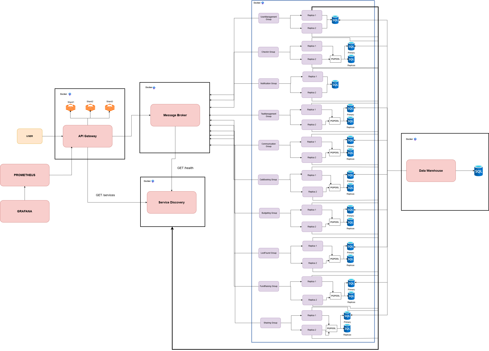

# FAF Cab Microservices Architecture

This repository contains the set of microservices powering **FAF Cab** and its community operations.  
Each service has a **clear boundary** and encapsulates specific functionality to ensure modularity, independence, and maintainability.  

---

## 📑 Table of Contents
- [Overview](#-overview)
- [Service Boundaries](#-service-boundaries)
  - [1. User Management Service](#1-user-management-service)
  - [2. Notification Service](#2-notification-service)
  - [3. Budgeting Service](#3-budgeting-service)
  - [4. Lost & Found Service](#4-lost--found-service)
  - [5. Cab Booking Service](#5-cab-booking-service)
  - [6. Check-in Service](#6-check-in-service)
  - [7. Tea Management Service](#7-tea-management-service)
  - [8. Communication Service](#8-communication-service)
  - [9. Fund Raising Service](#9-fund-raising-service)
  - [10. Sharing Service](#10-sharing-service)
- [Architecture Diagram](#-architecture-diagram)
- [Technologies and Communication Patterns](#️-technologies-and-communication-patterns)
- [Communication Contract and Data Management](#-communication-contract-and-data-management)
- [API Endpoints](#-api-endpoints)
- [Docker Images](#-docker-images)
- [Running the Project](#-running-the-project)
- [Infrastructure Documentation](#-infrastructure-documentation)
  - [Service Discovery](#service-discovery)
  - [API Gateway](#api-gateway)
- [Troubleshooting](#-troubleshooting)
- [Health Checks](#-health-checks)
- [Monitoring](#-monitoring)
- [Updating Services](#-updating-services)
- [Contribution Guidelines](#-contribution-guidelines)

---

## 🎯 Overview

FAF Cab is a microservices-based platform designed to manage various aspects of the FAF (Faculty of Automation and Computers) community operations. The platform consists of 11 independent microservices, each handling specific business domains, with an API Gateway coordinating external and internal communication.

---

## 📌 Service Boundaries

### 1. User Management Service
- **Responsibilities**:
  - Register and manage users.
  - Store details such as name, nickname, group, and role (student, teacher, admin).
  - Integrate with **Discord** to fetch information from the FAF Community Server.
- **Boundaries**:
  - Owns all user-related data and authentication.
  - Provides APIs for other services to fetch user details (nickname, role).
  - Does **not** handle notifications or resource tracking.

---

### 2. Notification Service
- **Responsibilities**:
  - Send notifications to the right people in a timely manner.
  - Cover cases such as:
    - Supplies running low.
    - Visitor exit reminders during bookings.
    - Communication infractions or bans.
- **Boundaries**:
  - Does not track resources itself; it only **consumes events** from other services and delivers messages.
  - Serves as the central notification hub.

---

### 3. Budgeting Service
- **Responsibilities**:
  - Track funds flowing in and out of FAF Cab & FAF NGO.
  - Maintain logs of spending and donations.
  - Manage a debt book for users who overuse or break property.
  - Allow admins to export reports as CSV.
- **Boundaries**:
  - Owns treasury and financial data.
  - Receives updates from **Tea Management Service**, **Sharing Service**, and **Fund Raising Service**.

---

### 4. Lost & Found Service
- **Responsibilities**:
  - Allow users to post announcements about lost or found items.
  - Support multiple comment threads per post.
  - Allow posts to be marked as resolved.
- **Boundaries**:
  - Owns lost & found posts and comments.
  - Can trigger notifications when a new post is created or resolved.

---

### 5. Cab Booking Service
- **Responsibilities**:
  - Manage scheduling of meetings in main room or kitchen.
  - Prevent collisions between exams, games, and other activities.
  - Allow students and teachers to book spaces.
  - Integrate with **Google Calendar**.
- **Boundaries**:
  - Owns booking schedules.
  - Provides booking status APIs to other services.
  - Triggers notifications (via **Notification Service**) for reminders and conflicts.

---

### 6. Check-in Service
- **Responsibilities**:
  - Simulate CCTV facial recognition for user entry/exit tracking.
  - Answer: *“Who has the key?”*
  - Allow registration of one-time guests.
  - Notify admins of unknown persons.
- **Boundaries**:
  - Owns check-in/check-out logs.
  - Relies on **User Management Service** for identity validation.
  - Publishes events to **Notification Service**.

---

### 7. Tea Management Service
- **Responsibilities**:
  - Track consumables (tea, sugar, paper cups, markers, etc.).
  - Record which user consumes what and when.
  - Trigger notifications when consumables run low or when a user overuses resources.
- **Boundaries**:
  - Owns inventory data for consumables.
  - Provides events to **Notification Service** and **Budgeting Service**.

---

### 8. Communication Service
- **Responsibilities**:
  - Allow users to find each other by nickname.
  - Enable public and private chats with individuals or groups.
  - Apply censorship with a banned-words list.
  - Enforce infractions and bans (temporary or permanent).
- **Boundaries**:
  - Owns messaging data and moderation logic.
  - Relies on **User Management Service** for nicknames and roles.
  - Sends infractions to **Notification Service**.

---

### 9. Fund Raising Service
- **Responsibilities**:
  - Enable admins to raise funds for purchases.
  - Store fundraising goals, deadlines, and donations.
  - Track donor contributions.
  - Automatically register new objects in **Tea Management** or **Sharing Service** after successful campaigns.
  - Update **Budgeting Service** with funds and expenses.
- **Boundaries**:
  - Owns fundraising campaigns and donor data.
  - Delegates financial tracking to **Budgeting Service**.

---

### 10. Sharing Service
- **Responsibilities**:
  - Track multi-use objects (games, cords, cups, kettles).
  - Allow users to rent and return objects.
  - Track object condition (damaged, missing parts, etc.).
  - Notify owners/admins if an object is misused or broken.
  - Update debt book for damages (via **Budgeting Service**).
- **Boundaries**:
  - Owns sharing inventory.
  - Publishes events to **Notification Service** and **Budgeting Service**.
  
  ---

## 🔗 Architecture Diagram



---

## ⚙️ Technologies and Communication Patterns

Each microservice is implemented with a different technology stack to ensure diversity, flexibility, and to reflect real-world scenarios where teams may use different languages/frameworks based on their strengths and service requirements.  

### 1. User Management Service
- **Technology**: Python, FastAPI, FastAPI-Users
- **Database**: PostgreSQL
- **Communication**: REST APIs (synchronous), publishes identity-related events via Message Broker.
- **Motivation**:  
  FastAPI provides high performance for REST APIs with minimal overhead.  
  The **FastAPI-Users** library accelerates user authentication and role management (students, teachers, admins).  
  Python’s flexibility and ease of integration with external services (like **Discord**) makes it a strong fit.  
  Trade-off: Not as performant as compiled languages, but speed of development and community support outweigh this for user management tasks.

---

### 2. Notification Service
- **Technology**: Python, FastAPI
- **Database**: PostgreSQL, Redis (for fast, temporary storage of notifications/queues)
- **Communication**:  
  - Consumes events asynchronously from the Message Broker.  
  - Sends REST responses (e.g., confirmation of notification status).  
- **Motivation**:  
  Notifications must be delivered quickly and reliably. Python with FastAPI allows quick prototyping and integration with async event systems.  
  Redis is ideal for short-lived, high-frequency messages.  
  Trade-off: Requires careful scaling to handle spikes in traffic.

---

### 3. Budgeting Service
- **Technology**: .NET 8 (ASP.NET Core Web API)
- **Database**: PostgreSQL
- **Communication**: REST APIs (for querying consumables), publishes events (low stock, overuse) to the Message Broker.
- **Motivation**:  
  .NET provides strong enterprise support and excellent integration with SQL Server.  
  Since this service tracks inventory with structured data, relational DB is a natural fit.  
  Trade-off: More rigid than NoSQL, but consistency and relational queries matter here.

---

### 4. Lost & Found Service
- **Technology**: .NET 8 (ASP.NET Core Web API)
- **Database**: PostgreSQL
- **Communication**: REST APIs (create posts, comment threads), publishes events (post created/resolved) to Notification Service.
- **Motivation**:  
  Flexible structure of posts and comments makes MongoDB a natural choice.  
  .NET ensures good performance and developer productivity.  
  Trade-off: Requires extra moderation logic, but performance is not a bottleneck here.

---

### 5. Cab Booking Service
- **Technology**: Java, Spring Boot
- **Database**: PostgreSQL
- **Communication**: REST APIs for booking, event publishing for reminders and conflicts.
- **Motivation**:  
  Spring Boot provides mature support for enterprise apps and integrates well with external services (e.g., Google Calendar).  
  PostgreSQL ensures consistency for scheduling and avoiding double-bookings.  
  Trade-off: Slightly steeper learning curve, but reliability justifies it.

---

### 6. Check-in Service
- **Technology**: Java, Spring Boot
- **Database**: PostgreSQL
- **Communication**:  
  - REST APIs to register check-in/check-out events.  
  - Publishes entry/exit logs asynchronously (events to Notification Service).  
- **Motivation**:  
  Java provides good support for scalability and performance under high load (simulating CCTV input).  
  PostgreSQL fits well with structured logs of entry/exit events.  
  Trade-off: More verbose than Python/.NET, but ideal for stable backend tracking.

---

### 7. Tea Management Service
- **Technology**: .NET 8 (ASP.NET Core Web API)
- **Database**: PostgreSQL
- **Communication**: REST APIs (for querying consumables), publishes events (low stock, overuse) to the Message Broker.
- **Motivation**:  
  .NET provides strong enterprise support and excellent integration with SQL Server.  
  Since this service tracks inventory with structured data, relational DB is a natural fit.  
  Trade-off: More rigid than NoSQL, but consistency and relational queries matter here.

---

### 8. Communication Service
- **Technology**: .NET 8 (SignalR for real-time communication)
- **Database**: PostgreSQL
- **Communication**:  
  - Real-time via WebSockets/SignalR.  
  - Publishes infractions to Notification Service via Message Broker.  
- **Motivation**:  
  Real-time chat requires stable, scalable WebSocket support. SignalR abstracts much of this complexity.  
  MongoDB handles unstructured chat data well (flexible schema).  
  Trade-off: Eventual consistency with NoSQL, but acceptable for chat data.

---

### 9. Fund Raising Service
- **Technology**: .NET 8 (ASP.NET Core Web API)
- **Database**: PostgreSQL
- **Communication**:  
  - REST APIs for campaign management.  
  - Publishes completion events to Budgeting, Tea Management, or Sharing Services.  
- **Motivation**:  
  PostgreSQL provides good relational modeling for campaigns, goals, and donations.  
  .NET allows strong integration with other services and event-driven workflows.  
  Trade-off: Campaign data is semi-structured, but consistency of donations outweighs flexibility.

---

### 10. Sharing Service
- **Technology**: .NET 8 (ASP.NET Core Web API)
- **Database**: PostgreSQL
- **Communication**:  
  - REST APIs for object rentals/returns.  
  - Publishes events to Notification Service (object broken, overdue).  
  - Updates Budgeting Service via events when debt must be tracked.  
- **Motivation**:  
  MongoDB’s flexible schema is useful for varied object states (games, cords, cups).  
  Event-driven approach ensures smooth integration with debt tracking.  
  Trade-off: Less strict consistency, but acceptable for sharing object states.

 

---

## 📡 Communication Patterns
- **Synchronous**:  
  - REST APIs (FastAPI, ASP.NET Core, Spring Boot) used for direct queries (user lookup, booking availability, lost & found posts).  
- **Asynchronous**:  
  - Message Broker (RabbitMQ) used for events:  
    - Notifications (infractions, booking reminders, consumables low).  
    - Budget updates (fundraising completion, consumables overuse).  
    - Resource state changes (object broken, sharing updates).  
- **Real-time**:  
  - WebSockets (SignalR) for chat and live user communication.  
 
---

## 📑 Communication Contract and Data Management

### 🔗 Communication Contract
To ensure **loose coupling** and **scalability**, services will communicate using a hybrid model of synchronous APIs and asynchronous events:

1. **Synchronous Communication (APIs)**  
   - Services expose **REST APIs** (FastAPI, ASP.NET Core, Spring Boot) for direct queries and updates.  
   - Examples:  
     - User Management Service provides user role/nickname lookup APIs.  
     - Cab Booking Service provides booking availability queries.  
     - Lost & Found Service provides APIs for creating posts and comments.  

2. **Asynchronous Communication (Events via Message Broker)**  
   - Services publish **domain events** (e.g., *ConsumablesLow*, *BookingCreated*, *ObjectBroken*) to a **Message Broker** (Kafka/RabbitMQ).  
   - Other services subscribe to events and react accordingly.  
   - Examples:  
     - Tea Management Service publishes *ConsumablesLow*, consumed by Notification Service.  
     - Sharing Service publishes *ObjectBroken*, consumed by Budgeting Service.  
     - Fund Raising Service publishes *CampaignCompleted*, consumed by Tea Management/Sharing Service + Budgeting Service.  

3. **Real-Time Communication**  
   - Communication Service uses **SignalR (WebSockets)** for live chat between users.  
   - Infractions are sent as async events to Notification Service.  

---

### 🗄️ Data Management Strategy

- **Database per Service**  
  Each microservice owns its own database. No other service is allowed to access it directly.  

- **Data Sharing via APIs**  
  Services requiring another service’s data must call its **public API** rather than accessing its database.  
  Example:  
  - Communication Service requests user nicknames from User Management API.  
  - Check-in Service validates user IDs against User Management API.  

- **Event-Driven Data Propagation**  
  For cross-service workflows, events are propagated via the Message Broker.  
  - Services maintain **local copies** of necessary external data (if needed), updated by events.  
  - Example: Budgeting Service stores debt entries when it receives events from Tea Management or Sharing Services.  

- **Consistency Model**  
  - **Strong consistency** within a service’s own database.  
  - **Eventual consistency** across services via asynchronous events.  
  - Trade-off: Eventual consistency allows decoupling and resilience at the cost of short delays in data propagation, which is acceptable for the FAFCab use case (e.g., budget updates, consumable logs).  

---

### 📡 Example Communication Flow
- A user consumes too much tea:  
  1. **Tea Management Service** records consumption in its SQL Server DB.  
  2. It publishes a `ConsumableOveruse` event to the **Message Broker**.  
  3. **Notification Service** consumes the event → notifies the admin.  
  4. **Budgeting Service** consumes the event → adds an entry to the debt book in SQL Server.  

  ---

  # 📚 API Endpoints

This section defines the **Communication Contract** (endpoints, request/response formats, and data types).
All services expose REST APIs and exchange data in **JSON format** (`Content-Type: application/json`).

---

## 🔎 Lost & Found Service

**Base URL:** `/api`  
**Database:** PostgreSQL  
**Technology Stack:** .NET

---

## Endpoints

### Health Check

#### Service Health Status
- **GET** `/api/post/health`
- **Description:** Check service health and get request statistics.
- **Response (200 OK):**
    ```json
    {
      "message": "Service is healthy and running",
      "requestCount": 1234,
      "timestamp": "2025-10-24T10:30:00Z"
    }
    ```

---

### Posts

#### Get All Posts
- **GET** `/api/post`
- **Description:** Retrieve all lost & found posts.
- **Response (200 OK):**
    ```json
    [
      {
        "postId": "p001",
        "title": "Lost USB Stick",
        "description": "Black Kingston USB stick, lost in FAFCab kitchen",
        "type": "lost",
        "userId": "u123",
        "status": "open",
        "createdAt": "2025-09-02T10:30:00Z",
        "comments": []
      }
    ]
    ```

#### Get Post by ID
- **GET** `/api/post/{postId}`
- **Description:** Retrieve details of a specific post.
- **Response (200 OK):**
    ```json
    {
      "postId": "p001",
      "title": "Lost USB Stick",
      "description": "Black Kingston USB stick, lost in FAFCab kitchen",
      "type": "lost",
      "userId": "u123",
      "status": "open",
      "createdAt": "2025-09-02T10:30:00Z",
      "comments": [
        {
          "commentId": "c001",
          "postId": "p001",
          "userId": "u555",
          "content": "I saw one in the main room yesterday",
          "createdAt": "2025-09-02T11:00:00Z"
        }
      ]
    }
    ```
- **Response (404 Not Found):** If not found.

#### Create a Post
- **POST** `/api/post`
- **Description:** Create a new lost or found item post.
- **Request:**
    ```json
    {
      "title": "Lost USB Stick",
      "description": "Black Kingston USB stick, lost in FAFCab kitchen",
      "type": "lost",
      "authorId": "u123"
    }
    ```
- **Response (201 Created):**
    ```json
    {
      "postId": "p001",
      "title": "Lost USB Stick",
      "description": "Black Kingston USB stick, lost in FAFCab kitchen",
      "type": "lost",
      "userId": "u123",
      "status": "open",
      "createdAt": "2025-09-02T10:30:00Z"
    }
    ```

#### Update a Post
- **PUT** `/api/post/{postId}`
- **Description:** Update an existing post.
- **Request:**
    ```json
    {
      "title": "Lost USB Stick (updated)",
      "description": "Updated description",
      "type": "lost",
      "authorId": "u123"
    }
    ```
- **Response (204 No Content):** On success.

#### Delete a Post
- **DELETE** `/api/post/{postId}`
- **Description:** Delete a post.
- **Response (204 No Content):** On success.

#### Resolve Post
- **POST** `/api/post/{postId}/resolve`
- **Description:** Mark a post as resolved by its creator.
- **Response (200 OK):**
    ```json
    "Post with ID p001 resolved successfully."
    ```

---

### Comments

#### Get All Comments for a Post
- **GET** `/api/post/{postId}/comments`
- **Description:** Retrieve all comments for a specific post.
- **Response (200 OK):**
    ```json
    [
      {
        "commentId": "c001",
        "postId": "p001",
        "userId": "u555",
        "content": "I saw one in the main room yesterday",
        "createdAt": "2025-09-02T11:00:00Z"
      }
    ]
    ```

#### Add Comment to Post
- **POST** `/api/post/{postId}/comments`
- **Description:** Add a comment to a post.
- **Request:**
    ```json
    {
      "postId": "p001",
      "authorId": "u555",
      "content": "I saw one in the main room yesterday"
    }
    ```
- **Response (201 Created):**
    ```json
    {
      "commentId": "c001",
      "postId": "p001",
      "userId": "u555",
      "content": "I saw one in the main room yesterday",
      "createdAt": "2025-09-02T11:00:00Z"
    }
    ```

#### Update a Comment
- **PUT** `/api/post/{postId}/comments/{commentId}`
- **Description:** Update a comment.
- **Request:**
    ```json
    {
      "postId": "p001",
      "authorId": "u555", 
      "content": "Updated comment"
    }
    ```
- **Response (204 No Content):** On success.

#### Delete a Comment
- **DELETE** `/api/post/{postId}/comments/{commentId}`
- **Description:** Delete a comment.
- **Response (204 No Content):** On success.

---

## 💰 Budgeting Service

**Base URL:** `/api`  
**Database:** PostgreSQL  
**Technology Stack:** .NET 9, Entity Framework Core

---

## Endpoints

### Balances

#### Get All Balances
- **GET** `/api/balance`
- **Description:** Returns all balances.
- **Response (200 OK):**
    ```json
    [
      {
        "balanceId": "guid",
        "currency": "EUR",
        "amount": 1520.75,
        "updatedAt": "2025-09-02T09:00:00Z"
      }
    ]
    ```

#### Get Balance by ID
- **GET** `/api/balance/{id}`
- **Description:** Returns a balance by its ID.
- **Response (200 OK):**
    ```json
    {
      "balanceId": "guid",
      "currency": "EUR",
      "amount": 1520.75,
      "updatedAt": "2025-09-02T09:00:00Z"
    }
    ```
- **Response (404 Not Found):** If not found.

#### Create Balance
- **POST** `/api/balance`
- **Request:**
    ```json
    {
      "currency": "EUR",
      "amount": 1000
    }
    ```
- **Response (201 Created):**
    ```json
    {
      "balanceId": "guid",
      "currency": "EUR",
      "amount": 1000,
      "updatedAt": "2025-09-02T09:00:00Z"
    }
    ```

#### Update Balance
- **PUT** `/api/balance/{id}/{transaction}`
- **Description:** Updates the balance amount by applying a transaction value (positive or negative).
- **Response (204 No Content):** On success.

#### Delete Balance
- **DELETE** `/api/balance/{id}`
- **Description:** Deletes a balance by ID.
- **Response (204 No Content):** On success.

#### Health Check
- **GET** `/api/balance/health`
- **Description:** Returns the health status of the balance service.
- **Response (200 OK):**
    ```json
    {
      "status": "Healthy",
      "timestamp": "2025-10-09T12:00:00Z"
    }
    ```

#### Test Gateway Timeout
- **GET** `/api/balance/test-timeout?delaySeconds=5`
- **Description:** Test endpoint to verify gateway timeout functionality. Delays response for specified seconds.
- **Query Parameters:**
  - `delaySeconds` (optional, default: 5): Number of seconds to delay the response
- **Response (200 OK):**
    ```json
    {
      "requestId": "guid",
      "message": "Request completed successfully after 5 seconds",
      "completedAt": "2025-10-09T12:00:05Z",
      "delaySeconds": 5
    }
    ```
- **Response (408 Request Timeout):** If gateway timeout is exceeded

#### Test Gateway Concurrency
- **GET** `/api/balance/test-concurrency?workDurationSeconds=3`
- **Description:** Test endpoint to verify gateway concurrency limits. Simulates work for specified duration.
- **Query Parameters:**
  - `workDurationSeconds` (optional, default: 3): Duration of simulated work in seconds
- **Response (200 OK):**
    ```json
    {
      "requestId": "guid",
      "message": "Concurrency test completed successfully",
      "startTime": "2025-10-09T12:00:00Z",
      "endTime": "2025-10-09T12:00:03Z",
      "durationSeconds": 3.001,
      "workDurationSeconds": 3
    }
    ```

#### Test Concurrency Batch Instructions
- **GET** `/api/balance/test-concurrency-batch?count=10&workDurationSeconds=3`
- **Description:** Returns instructions and examples for testing gateway concurrency with multiple simultaneous requests.
- **Query Parameters:**
  - `count` (optional, default: 10): Number of concurrent requests to suggest
  - `workDurationSeconds` (optional, default: 3): Duration for each test request
- **Response (200 OK):**
    ```json
    {
      "message": "Make 10 concurrent GET requests to /api/balance/test-concurrency?workDurationSeconds=3",
      "endpoint": "/api/balance/test-concurrency?workDurationSeconds=3",
      "suggestedTool": "Use a tool like Apache Bench, wrk, or a script to send concurrent requests",
      "examples": [
        "curl (sequential): for i in {1..10}; do curl http://localhost:8087/api/balance/test-concurrency?workDurationSeconds=3 & done; wait",
        "Apache Bench: ab -n 10 -c 10 http://localhost:8087/api/balance/test-concurrency?workDurationSeconds=3"
      ],
      "expectedBehavior": {
        "withConcurrencyLimit": "Some requests will wait in queue if limit is exceeded",
        "withTimeout": "Requests taking longer than gateway timeout will fail with 408 or 504",
        "successfulRequests": "Should return 200 OK with timing information"
      }
    }
    ```

---

### Transactions

#### Get All Transactions
- **GET** `/api/transactions`
- **Description:** Retrieve a list of all transactions.
- **Response (200 OK):**
    ```json
    [
      {
        "transactionId": "guid",
        "balanceId": "guid",
        "type": "income",
        "amount": 200.00,
        "currency": "EUR",
        "source": "Partner NGO",
        "userId": "guid",
        "createdAt": "2025-08-20T14:30:00Z"
      }
    ]
    ```

#### Get Transaction by ID
- **GET** `/api/transactions/{id}`
- **Description:** Retrieve a transaction by its ID.
- **Response (200 OK):**
    ```json
    {
      "transactionId": "guid",
      "balanceId": "guid",
      "type": "income",
      "amount": 200.00,
      "currency": "EUR",
      "source": "Partner NGO",
      "userId": "guid",
      "createdAt": "2025-08-20T14:30:00Z"
    }
    ```
- **Response (404 Not Found):** If not found.

#### Add a Transaction
- **POST** `/api/transactions`
- **Description:** Create a new transaction and automatically send notification to the user.
- **Request:**
    ```json
    {
      "balanceId": "guid",
      "type": "expense",
      "amount": 75.00,
      "currency": "EUR",
      "source": "New Board Markers",
      "userId": "guid"
    }
    ```
- **Response (201 Created):**
    ```json
    {
      "transactionId": "guid",
      "balanceId": "guid",
      "type": "expense",
      "amount": 75.00,
      "currency": "EUR",
      "source": "New Board Markers",
      "userId": "guid",
      "createdAt": "2025-09-02T10:00:00Z"
    }
    ```

#### Delete Transaction
- **DELETE** `/api/transactions/{id}`
- **Description:** Deletes a transaction by ID.
- **Response (204 No Content):** On success.

#### Export Transactions as CSV
- **GET** `/api/transactions/export`
- **Description:** Export all transactions as CSV.
- **Response (200 OK):**
    ```
    Content-Type: text/csv

    TransactionId,BalanceId,Type,Amount,Currency,Source,UserId,CreatedAt
    ...
    ```

#### Test Notification Connectivity
- **GET** `/api/transactions/test-notification`
- **Description:** Test endpoint to verify connectivity to the notification service.
- **Response (200 OK):**
    ```json
    {
      "success": true,
      "statusCode": 200,
      "responseBody": "...",
      "envVars": {
        "notificationUrl": "http://api-gateway:8001/internal/notification",
        "httpProxy": null,
        "httpsProxy": null,
        "noProxy": null
      }
    }
    ```
- **Response (500 Internal Server Error):** If connectivity test fails

#### Broadcast Notification to All Users
- **POST** `/api/transactions/broadcast-notification`
- **Description:** Send a notification to all users in the system (admin only).
- **Request:**
    ```json
    {
      "notificationType": "info",
      "message": "📢 System maintenance scheduled for tonight at 10 PM UTC"
    }
    ```
- **Response (200 OK):** If notification sent successfully
- **Response (500 Internal Server Error):** If notification failed

#### Notify Admins
- **POST** `/api/transactions/notify-admins`
- **Description:** Send a notification to all admin users.
- **Request:**
    ```json
    {
      "notificationType": "warning",
      "message": "⚠️ High debt amount detected for user XYZ"
    }
    ```
- **Response (200 OK):** If notification sent successfully
- **Response (404 Not Found):** If no admin users found
- **Response (500 Internal Server Error):** If notification failed

---

### Debts

#### Get All Debts
- **GET** `/api/debts`
- **Description:** Retrieve a list of all debts.
- **Response (200 OK):**
    ```json
    [
      {
        "debtId": "guid",
        "userId": "guid",
        "description": "Broke kettle",
        "amount": 30.00,
        "currency": "EUR",
        "status": "Pending",
        "createdAt": "2025-09-02T09:00:00Z",
        "dueDate": "2025-09-12T09:00:00Z",
        "paidAt": null,
        "paymentMethod": null
      }
    ]
    ```

#### Get Debt by ID
- **GET** `/api/debts/{id}`
- **Description:** Retrieve a debt by its ID.
- **Response (200 OK):**
    ```json
    {
      "debtId": "guid",
      "userId": "guid",
      "description": "Broke kettle",
      "amount": 30.00,
      "currency": "EUR",
      "status": "Pending",
      "createdAt": "2025-09-02T09:00:00Z",
      "dueDate": "2025-09-12T09:00:00Z",
      "paidAt": null,
      "paymentMethod": null
    }
    ```
- **Response (404 Not Found):** If not found.

#### Register Debt
- **POST** `/api/debts`
- **Description:** Create a new debt record.
- **Request:**
    ```json
    {
      "userId": "guid",
      "description": "Consumed 10 tea bags in one day",
      "amount": 5.00,
      "currency": "EUR",
      "dueDate": "2025-09-12T09:00:00Z"
    }
    ```
- **Response (201 Created):**
    ```json
    {
      "debtId": "guid",
      "userId": "guid",
      "description": "Consumed 10 tea bags in one day",
      "amount": 5.00,
      "currency": "EUR",
      "status": "Pending",
      "createdAt": "2025-09-02T13:00:00Z",
      "dueDate": "2025-09-12T09:00:00Z",
      "paidAt": null,
      "paymentMethod": null
    }
    ```

#### Pay Debt
- **PUT** `/api/debts/{id}/pay`
- **Description:** Mark a debt as paid with the specified payment method.
- **Request:**
    ```json
    "cash"
    ```
- **Response (204 No Content):** On success.

---

## Background Services

### Balance Monitor
Automatically monitors system balances and sends notifications to admins when balances fall below configured thresholds.

- **Check Interval:** Configurable via `BALANCE_CHECK_INTERVAL_MINUTES` (default: 5 minutes)
- **Thresholds:**
  - USD: `LOW_BALANCE_THRESHOLD_USD` (default: 100)
  - EUR: `LOW_BALANCE_THRESHOLD_EUR` (default: 100)
  - MDL: `LOW_BALANCE_THRESHOLD_MDL` (default: 2000)
  - RON: `LOW_BALANCE_THRESHOLD_RON` (default: 500)

### Debt Expiration Monitor
Automatically monitors unpaid debts and sends notifications to users and admins when debts are approaching due date or overdue.

- **Check Interval:** Configurable via `DEBT_CHECK_INTERVAL_HOURS` (default: 12 hours)
- **Notification Days:** Configurable via `DEBT_NOTIFICATION_DAYS` (default: 7,3,1,0 days before due date)
- **Features:**
  - Sends notifications at 7, 3, 1 days before due date
  - Sends notification on due date (day 0)
  - Sends notifications for overdue debts
  - Different urgency levels based on days until due


## Cab Booking Service
**Base url:** `/api/bookings`

**Database:** PostgreSQL

**Technology stack:** Java & Spring boot

### 1. Create a booking
- **POST**
- **Description:** Create a booking of any of the rooms in Google Calendar
  **Request:**
``` json
{
    "user_email": "username@gmail.com",
    "room_uuid": "c75f7c66-e858-47d6-bb82-7ea5547c800c",
    "startIso": "2025-09-06T09:00:00+03:00",
    "endIso": "2025-09-06T09:00:00+03:00",
    "attendees": [
        {
            "user_email": "username@gmail.com",
            "role_name": "STUDENT"
        },
        {
            "user_email": "username@gmail.com",
            "role_name": "STUDENT"
        }
    ]
}
```
**Response:**
``` json
{
  "id": "c75f7c66-e858-47d6-bb82-7ea5547c800c",
  "booking_uuid": "c75f7c66-e858-47d6-bb82-7ea5547c800c",
  "room_uuid": "c75f7c66-e858-47d6-bb82-7ea5547c800c",
  "user_email": "username@gmail.com"
  "startIso": "2025-09-06T09:00:00+03:00",
  "endIso": "2025-09-06T09:00:00+03:00",
  "googleEventId": "c75f7c66-e858-47d6-bb82-7ea5547c800c",
  "created_at": "2025-09-06T09:00:00+03:00"
}
```

### 2. Get all bookings
- **GET**
- **Description:** Get all registered bookings
  **Response:**
``` json
{
    {
        "id": "c75f7c66-e858-47d6-bb82-7ea5547c800c",
        "booking_uuid": "c75f7c66-e858-47d6-bb82-7ea5547c800c",
        "room_uuid": "c75f7c66-e858-47d6-bb82-7ea5547c800c",
        "user_email": "username@gmail.com"
        "startIso": "2025-09-06T09:00:00+03:00",
        "endIso": "2025-09-06T09:00:00+03:00",
        "googleEventId": "c75f7c66-e858-47d6-bb82-7ea5547c800c"
    },
    {
        "id": "c75f7c66-e858-47d6-bb82-7ea5547c800c",
        "booking_uuid": "c75f7c66-e858-47d6-bb82-7ea5547c800c",
        "room_uuid": "c75f7c66-e858-47d6-bb82-7ea5547c800c",
        "user_email": "username@gmail.com"
        "startIso": "2025-09-06T09:00:00+03:00",
        "endIso": "2025-09-06T09:00:00+03:00",
        "googleEventId": "c75f7c66-e858-47d6-bb82-7ea5547c800c"
    }
}
```
### 3. Get booking by uuid
- **GET** `/{booking_uuid}`
- **Description:** Get booking by it's uuid
  **Response:**
``` json
{
  "id": "c75f7c66-e858-47d6-bb82-7ea5547c800c",
  "booking_uuid": "c75f7c66-e858-47d6-bb82-7ea5547c800c",
  "room_uuid": "c75f7c66-e858-47d6-bb82-7ea5547c800c",
  "user_email": "username@gmail.com"
  "startIso": "2025-09-06T09:00:00+03:00",
  "endIso": "2025-09-06T09:00:00+03:00",
  "googleEventId": "c75f7c66-e858-47d6-bb82-7ea5547c800c"
}
```
### 4. Cancel a booking
- **DELETE** `/{booking_uuid}`
- **Description:** Cancel a booking by it's uuid
  **Response:**
``` json
{
  "status": "canceled"
  "booking_uuid": "c75f7c66-e858-47d6-bb82-7ea5547c800c"
}
```
### 5. Add/Remove attendees
- **PATCH** `/{booking_uuid}/attendees`
- **Description:** Add or remove attendees from a google calendar booking
  **Request:**
``` json
{
  "add": [
    {
      "user_email": "username@gmail.com"
      "role_name": "STUDENT"
    }
  ],
  "remove": [
    {
      "user_email": "username@gmail.com"
      "role_name": "STUDENT"
    }
  ]
}
```
**Response:**
``` json
{
  "booking_uuid": "c75f7c66-e858-47d6-bb82-7ea5547c800c",
  "attendees": [
    {
      "user_email": "username@gmail.com"
      "status": "added"
    },
    {
      "user_email": "username@gmail.com"
      "status": "removed"
    }
  ],
  "updatedAt": "2025-09-06T09:00:00+03:00"
}
```
### 6. Get attendees of a booking
- **GET** /{booking_uuid}/attendees`
- **Description:** Get all attendees of a booking
  **Response:**
``` json
{
    {
        "booking_uuid": "c75f7c66-e858-47d6-bb82-7ea5547c800c",
        "user_email: "username@gmail.com"
    },
    {
        "booking_uuid": "c75f7c66-e858-47d6-bb82-7ea5547c800c",
        "user_email: "username@gmail.com"
    }
}
```
### 7. Google calendare response
``` json
{
  "kind": "calendar#event",
  "id": "97nt9h22gfb7ojk7hm2k3ajob0",
  "status": "confirmed",
  "htmlLink": "https://www.google.com/calendar/event?eid=...",
  "summary": "Room booked by Alice",
  "start": { "dateTime": "2025-09-06T09:00:00+03:00" },
  "end":   { "dateTime": "2025-09-06T10:00:00+03:00" },
  "attendees": [
    { 
        "email": "username@gmail.com", 
        "responseStatus": "needsAction" 
    }
  ]
}
```

---

# Check-in Service
**Base url:** `/api/check_in`

**Database:** PostgreSQL

**Technology stack:** Java & Spring boot

### 1. Create an entry
- **POST**
- **Database:** PostgreSQL
- **Technology stack:** Java & Spring boot
  **Request:**
``` json
{
    "id": "c75f7c66-e858-47d6-bb82-7ea5547c800c",
    "registered_uuid": "c75f7c66-e858-47d6-bb82-7ea5547c800c", (OPTIONAL)    
    "unregistered_uuid": "guest_uuid": "c75f7c66-e858-47d6-bb82-7ea5547c800c", (OPTIONAL)
    "entry_time": "2025-09-06T09:00:00+03:00"
}
```
**Response:**
``` json
{
    "entry_uuid": "c75f7c66-e858-47d6-bb82-7ea5547c800c",
    "registered_uuid": "c75f7c66-e858-47d6-bb82-7ea5547c800c", (OPTIONAL)
    "unregistered_uuid": "c75f7c66-e858-47d6-bb82-7ea5547c800c", (OPTIONAL)
    "authorized": True (False if no user/guest uuid provided)
    "entry_time": "2025-09-06T09:00:00+03:00",
    "exit_time": "2025-09-06T09:00:00+03:00"
}
```

### 2. Get an entry
- **GET** `/{entry_uuid}`
- **Description:** Get an entry via its uuid
  **Response:**
``` json
{
    "entry_uuid": "c75f7c66-e858-47d6-bb82-7ea5547c800c",
    "registered_uuid": "c75f7c66-e858-47d6-bb82-7ea5547c800c", (OPTIONAL)
    "unregistered_uuid": "c75f7c66-e858-47d6-bb82-7ea5547c800c", (OPTIONAL)
    "authorized": True (False if no user/guest uuid provided)
    "entry_time": "2025-09-06T09:00:00+03:00",
    "exit_time": "2025-09-06T09:00:00+03:00"
}
```

### 3. Create a guest
- **POST** `/create_guest`
- **Description:** Create a guest
  **Request:**
``` json
{
    "user_uuid": "c75f7c66-e858-47d6-bb82-7ea5547c800c",
    "guest_name": "JohnDoe"
    "room_uuid": "c75f7c66-e858-47d6-bb82-7ea5547c800c"
}
```
**Response:**
``` json
{
    "guest_uuid": "c75f7c66-e858-47d6-bb82-7ea5547c800c",
    "registered_by": "c75f7c66-e858-47d6-bb82-7ea5547c800c",
    "room_uuid": "c75f7c66-e858-47d6-bb82-7ea5547c800c"
}
```

### 4. Get all guests
- **GET**
- **Description:** Get all guests that were registered
  **Response:**
``` json
{
    {
        "guest_uuid": "c75f7c66-e858-47d6-bb82-7ea5547c800c",
        "registered_by": "c75f7c66-e858-47d6-bb82-7ea5547c800c",
        "room_uuid": "c75f7c66-e858-47d6-bb82-7ea5547c800c"
    },
    {
        "guest_uuid": "c75f7c66-e858-47d6-bb82-7ea5547c800c",
        "registered_by": "c75f7c66-e858-47d6-bb82-7ea5547c800c",
        "room_uuid": "c75f7c66-e858-47d6-bb82-7ea5547c800c"
    }
}
```

## ☕️ Tea Management Service

**Base URL:** `/api/consumables`  
**Database:** PostgreSQL  
**Technology Stack:** .NET

### 1. Get All Consumables
- **GET** `/`
- **Description:** Retrieve a list of all consumables and their current stock levels.
**Response (200 OK):**
```json
[
  {
    "uuid": "00000000-0000-0000-0000-000000000000",
    "name": "string",
    "image_link": "string",
    "amount": 0.0,
    "amount_type": "GRAMS",
    "threshold": 0.0,
    "edited_at": "2025-09-02T10:30:00Z"
  }
]
```
### 2. Get Consumable by UUID
- **GET** `/{consumable_uuid}`
- **Description:** Retrieve details of a specific consumable by its UUID.
**Response (200 OK):**
```json
{
  "uuid": "00000000-0000-0000-0000-000000000000",
  "name": "string",
  "image_link": "string",
  "amount": 0.0,
  "amount_type": "GRAMS",
  "threshold": 0.0,
  "edited_at": "2025-09-02T10:30:00Z"
}
```
### 3. Add a New Consumable
- **POST** `/`
- **Description:** Add a new consumable to the inventory.
**Request:**
```json
{
  "name": "string",
  "image": "blob",
  "amount": 0.0,
  "amount_type": "GRAMS",
  "threshold": 0.0
}
```
**Response (201 Created):**
```json
{
  "uuid": "00000000-0000-0000-0000-000000000000",
  "name": "string",
  "image_link": "string",
  "amount": 0.0,
  "amount_type": "GRAMS",
  "threshold": 0.0,
  "edited_at": "2025-09-02T10:30:00Z"
}
```
### 4. Update Consumable Details
- **PATCH** `/{consumable_uuid}`
- **Description:** Update details of a specific consumable (name, image, threshold).
**Request:**
```json
{
  "name": "string",
  "image": "blob",
  "threshold": 0.0
}
```
**Response (200 OK):**
```json
{
  "uuid": "00000000-0000-0000-0000-000000000000",
  "name": "string",
  "image_link": "string",
  "amount": 0.0,
  "amount_type": "GRAMS",
  "threshold": 0.0,
  "edited_at": "2025-09-02T10:30:00Z"
}
```
### 5. Delete a Consumable
- **DELETE** `/{consumable_uuid}`
- **Description:** Remove a consumable from the inventory.
**Response (204 No Content):**
_No body_
### 6. Get Consumption Logs
- **GET** `/logs`
- **Description:** Retrieve a list of all consumption logs.
**Response (200 OK):**
```json
[
  {
    "user_name": "string",
    "user_surname": "string",
    "user_uuid": "00000000-0000-0000-0000-000000000000",
    "name": "string",
    "image_link": "string",
    "consumable_uuid": "00000000-0000-0000-0000-000000000000",
    "amount": 0.0,
    "amount_type": "GRAMS",
    "created_at": "2025-09-02T10:30:00Z"
  }
]
```
### 7. Log Consumable Usage
- **POST** `/logs/use`
- **Description:** Log the usage of a consumable by a user.
**Request:**
```json
{
  "user_uuid": "00000000-0000-0000-0000-000000000000",
  "consumable_uuid": "00000000-0000-0000-0000-000000000000",
  "amount": 0.0
}
```
**Response (201 Created):**
```json
{
  "user_name": "string",
  "user_surname": "string",
  "user_uuid": "00000000-0000-0000-0000-000000000000",
  "name": "string",
  "image_link": "string",
  "consumable_uuid": "00000000-0000-0000-0000-000000000000",
  "amount": 0.0,
  "amount_type": "GRAMS",
  "created_at": "2025-09-02T10:30:00Z"
}
```
### 8. Log Consumable Restock
- **POST** `/logs/restock`
- **Description:** Log the restock of a consumable by an admin.
**Request:**
```json
{
  "user_uuid": "00000000-0000-0000-0000-000000000000",
  "consumable_uuid": "00000000-0000-0000-0000-000000000000",
  "amount": 0.0
}
```
**Response (201 Created):**
```json
{
  "user_name": "string",
  "user_surname": "string",
  "user_uuid": "00000000-0000-0000-0000-000000000000",
  "name": "string",
  "image_link": "string",
  "consumable_uuid": "00000000-0000-0000-0000-000000000000",
  "amount": 0.0,
  "amount_type": "GRAMS",
  "created_at": "2025-09-02T10:30:00Z"
}
```
---

## 💬 Communication Service
**Base URL:** `/api/chat`
**Database:** MongoDB, PostgreSQL
**Technology Stack:** .NET (SignalR for real-time communication)
### 1. Connect to Chat Hub
- **Endpoint:** `/chatHub`
- **Description:** Establish a WebSocket connection to the chat hub using SignalR.
- **Request:**
  - Use SignalR client to connect to the hub.
- **Response:**
  - WebSocket connection established.
### 2. Send Message to Chat
- **Method:** `SendMessage`
- **Description:** Send a message to a private chat.
- **Request:**
```json
{
  "user_id": "string",
  "message": "string"
}
```
- **Response:**
  - Message sent confirmation.
### 3. Send Message to Channel
- **Method:** `SendChannelMessage`
- **Description:** Send a message to a specific channel.
- **Request:**
```json
{
  "channel_id": "string",
  "message": "string"
}
```
- **Response:**
  - Message sent confirmation.
### 4. Receive Messages
- **Method:** `ReceiveMessage`
- **Description:** Receive messages from the chat hub.
- **Response:**
```json
[
  {
    "message_id": "string",
    "sender_id": "string",
    "channel_id": "string",
    "content": "string",
    "sent_at": "2025-09-02T10:30:00Z",
    "read": false
  }
]
```

## 🤝 Sharing Service
**Base URL:** `/api/sharing`
**Database:** PostgreSQL
**Technology Stack:** .NET 
### 1. Get All Shareable Items
- **GET** `/items`
- **Description:** Retrieve a list of all shareable items and their current status.
**Response (200 OK):**
```json
[
  {
    "uuid": "00000000-0000-0000-0000-000000000000",
    "owner_name": "string",
    "owner_surname": "string",
    "owner_uuid": "00000000-0000-0000-0000-000000000000",
    "category": "GAMES",
    "name": "string",
    "image_link": "string",
    "is_available": true,
    "is_usable": true,
    "state": "string",
  }
]
```
### 2. Get Shareable Items by UUID
- **GET** `/{item_uuid}`
- **Description:** Retrieve details of a specific shareable item by its UUID.
**Response (200 OK):**
```json
{
  "uuid": "00000000-0000-0000-0000-000000000000",
  "owner_name": "string",
  "owner_surname": "string",
  "owner_uuid": "00000000-0000-0000-0000-000000000000",
  "category": "GAMES",
  "name": "string",
  "image_link": "string",
  "is_available": true,
  "is_usable": true,
  "state": "string",
}
```
### 3. Add a New Shareable Item
- **POST** `/items`
- **Description:** Add a new shareable item to the inventory.
**Request:**
```json
{
  "owner_uuid": "00000000-0000-0000-0000-000000000000",
  "category": "GAMES",
  "name": "string",
  "image": "blob",
  "state": "string"
}
```
**Response (201 Created):**
```json
{
  "uuid": "00000000-0000-0000-0000-000000000000",
  "owner_name": "string",
  "owner_surname": "string",
  "owner_uuid": "00000000-0000-0000-0000-000000000000",
  "category": "GAMES",
  "name": "string",
  "image_link": "string",
  "is_available": true,
  "is_usable": true,
  "state": "string",
}
```
### 4. Update Shareable Item Details
- **PATCH** `/{item_uuid}`
- **Description:** Update details of a specific shareable item (name, image, state).
**Request:**
```json
{
  "name": "string",
  "image": "blob",
  "state": "string"
}
```
**Response (200 OK):**
```json
{
  "uuid": "00000000-0000-0000-0000-000000000000",
  "owner_name": "string",
  "owner_surname": "string",
  "owner_uuid": "00000000-0000-0000-0000-000000000000",
  "category": "GAMES",
  "name": "string",
  "image_link": "string",
  "is_available": true,
  "is_usable": true,
  "state": "string",
}
```
### 5. Delete a Shareable Item
- **DELETE** `/{item_uuid}`
- **Description:** Remove a shareable item from the inventory.
**Response (204 No Content):**
_No body_
### 6. Rent a Shareable Item
- **POST** `/rent`
- **Description:** Rent a shareable item to a user.
**Request:**
```json
{
  "user_uuid": "00000000-0000-0000-0000-000000000000",
  "item_uuid": "00000000-0000-0000-0000-000000000000",
  "borrowed_at": "2025-09-02T10:30:00"
}
```
**Response (201 Created):**
```json
{ 
  "uuid": "00000000-0000-0000-0000-000000000000",
  "user_name": "string",
  "user_surname": "string",
  "user_uuid": "00000000-0000-0000-0000-000000000000",
  "item_name": "string", 
  "item_uuid": "00000000-0000-0000-0000-000000000000",
  "borrowed_at": "2025-09-02T10:30:00",
  "to_be_returned_at": "2025-09-09T10:30:00",
}
```
### 7. Return a Shareable Item
- **POST** `/return`
- **Description:** Return a rented shareable item.
**Request:**
```json
{
  "rental_uuid": "00000000-0000-0000-0000-000000000000",
  "is_usable": true,
  "state": "string"
}
```
**Response (200 OK):**
```json
{
  "uuid": "00000000-0000-0000-0000-000000000000",
  "user_name": "string",
  "user_surname": "string",
  "user_uuid": "00000000-0000-0000-0000-000000000000",
  "item_name": "string", 
  "item_uuid": "00000000-0000-0000-0000-000000000000",
  "borrowed_at": "2025-09-02T10:30:00",
  "to_be_returned_at": "2025-09-09T10:30:00",
  "returned_at": "2025-09-05T10:30:00",
  "is_usable": true,
  "return_state_borrower": "string"
}
```   
### 8. Confirm Return
- **POST** `/confirm-return`
- **Description:** Confirm the return of a rented shareable item by the owner.
**Request:**
```json
{
  "rental_uuid": "00000000-0000-0000-0000-000000000000",
  "is_usable": true,
  "state": "string"
}
```
**Response (200 OK):**
```json
{
  "uuid": "00000000-0000-0000-0000-000000000000",
  "user_name": "string",
  "user_surname": "string",
  "user_uuid": "00000000-0000-0000-0000-000000000000",
  "item_name": "string", 
  "item_uuid": "00000000-0000-0000-0000-000000000000",
  "borrowed_at": "2025-09-02T10:30:00",
  "to_be_returned_at": "2025-09-09T10:30:00",
  "returned_at": "2025-09-05T10:30:00",
  "is_usable": true,
  "return_state_borrower": "string",
  "return_state_owner": "string"
}
``` 
## 💸 Fund Raising Service
**Base URL:** `/api/fundraising`
**Database:** PostgreSQL
**Technology Stack:** .NET
### 1. Get All Fundraising Campaigns
- **GET** `/`
- **Description:** Retrieve a list of all fundraising campaigns.
**Response (200 OK):**
```json
[
  {
    "uuid": "00000000-0000-0000-0000-000000000000",
    "author_name": "string",
    "author_surname": "string",
    "author_uuid": "00000000-0000-0000-0000-000000000000",
    "good_name": "string",
    "good_amount": 0.0,
    "good_type": "MONEY",
    "good_uuid": "00000000-0000-0000-0000-000000000000",
    "title": "string",
    "description": "string",
    "amount": 0.0,
    "target": 0.0,
    "created_at": "2025-09-02T10:30:00Z",
    "expires_at": "2025-09-02T10:30:00Z",
    "is_active": true
  }
]
```
### 2. Get Fundraising Campaign by UUID
- **GET** `/{fundraiser_uuid}`
- **Description:** Update details of a specific fundraising campaign (title, description, target, expires_at).  
**Request:**
```json
{
  "title": "string",
  "description": "string",
  "target": 0.0,
  "expires_at": "2025-09-02T10:30:00Z"
}
``` 
**Response (200 OK):**
```json
{
  "uuid": "00000000-0000-0000-0000-000000000000",
  "author_name": "string",
  "author_surname": "string",
  "author_uuid": "00000000-0000-0000-0000-000000000000",
  "good_name": "string",
  "good_amount": 0.0,
  "good_type": "MONEY",
  "good_uuid": "00000000-0000-0000-0000-000000000000",
  "title": "string",
  "description": "string",
  "amount": 0.0,
  "target": 0.0,
  "created_at": "2025-09-02T10:30:00Z",
  "expires_at": "2025-09-02T10:30:00Z",
  "is_active": true
}
```   
### 3. Create a New Fundraising Campaign
- **POST** `/`
- **Description:** Create a new fundraising campaign.
**Request:**
```json
{
  "author_uuid": "00000000-0000-0000-0000-000000000000",
  "good_uuid": "00000000-0000-0000-000000000000",
  "title": "string",
  "description": "string",
  "target": 0.0,
  "expires_at": "2025-09-02T10:30:00Z"
}
```
**Response (201 Created):**
```json
{
  "uuid": "00000000-0000-0000-0000-000000000000",
  "author_name": "string",
  "author_surname": "string",
  "author_uuid": "00000000-0000-0000-0000-000000000000",
  "good_name": "string",
  "good_amount": 0.0,
  "good_type": "MONEY",
  "good_uuid": "00000000-0000-0000-0000-000000000000",
  "title": "string",
  "description": "string",
  "amount": 0.0,
  "target": 0.0,
  "created_at": "2025-09-02T10:30:00Z",
  "expires_at": "2025-09-02T10:30:00Z",
  "is_active": true
}
```
### 4. Update Fundraising Campaign Details
- **PATCH** `/{fundraiser_uuid}`
- **Description:** Update details of a specific fundraising campaign (title, description, target, expires_at).  
**Request:**
```json
{
  "title": "string",
  "description": "string",
  "target": 0.0,
  "expires_at": "2025-09-02T10:30:00Z"
}
``` 
**Response (200 OK):**
```json
{
  "uuid": "00000000-0000-0000-0000-000000000000",
  "author_name": "string",
  "author_surname": "string",
  "author_uuid": "00000000-0000-0000-0000-000000000000",
  "good_name": "string",
  "good_amount": 0.0,
  "good_type": "MONEY",
  "good_uuid": "00000000-0000-0000-0000-000000000000",
  "title": "string",
  "description": "string",
  "amount": 0.0,
  "target": 0.0,
  "created_at": "2025-09-02T10:30:00Z",
  "expires_at": "2025-09-02T10:30:00Z",
  "is_active": true
}
```   
### 5. Delete a Fundraising Campaign 
- **DELETE** `/{fundraiser_uuid}`
- **Description:** Delete a specific fundraising campaign by its UUID.
**Response (204 No Content):**
_No body_
### 6. Create a Donation
- **POST** `/donations`
- **Description:** Create a new donation towards a fundraising campaign.
**Request:**
```json
{
  "fundraiser_uuid": "00000000-0000-0000-0000-000000000000",
  "user_uuid": "00000000-0000-0000-0000-000000000000",
  "amount": 0.0
}
```
**Response (201 Created):**
```json
{
  "uuid": "00000000-0000-0000-0000-000000000000",
  "fundraiser_title": "string",
  "fundraiser_uuid": "00000000-0000-0000-0000-000000000000",
  "good_name": "string",
  "good_uuid": "00000000-0000-0000-0000-000000000000",
  "user_name": "string",
  "user_surname": "string",
  "user_uuid": "00000000-0000-0000-0000-000000000000",
  "amount": 0.0,
  "created_at": "2025-09-02T10:30:00Z"
}
```
### 7. Get Donations by Fundraiser UUID
- **GET** `/donations/{fundraiser_uuid}`
- **Description:** Retrieve all donations made towards a specific fundraising campaign.
**Response (200 OK):**
```json
[
  {
    "uuid": "00000000-0000-0000-0000-000000000000",
    "fundraiser_title": "string",
    "fundraiser_uuid": "00000000-0000-0000-0000-000000000000",
    "good_name": "string",
    "good_uuid": "00000000-0000-0000-0000-000000000000",
    "user_name": "string",
    "user_surname": "string",
    "user_uuid": "00000000-0000-0000-0000-000000000000",
    "amount": 0.0,
    "created_at": "2025-09-02T10:30:00Z"
  }
]
```
### 8. Get Donations by User UUID
- **GET** `/donations/user/{user_uuid}`
- **Description:** Retrieve all donations made by a specific user.
**Response (200 OK):**
```json
[
  { 
    "uuid": "00000000-0000-0000-0000-000000000000",
    "fundraiser_title": "string",
    "fundraiser_uuid": "00000000-0000-0000-0000-000000000000",
    "good_name": "string",
    "good_uuid": "00000000-0000-0000-0000-000000000000",
    "amount": 0.0,
    "created_at": "2025-09-02T10:30:00Z"
  }
]
```
---

## 📚 Infrastructure Documentation

This project includes three critical infrastructure components that enable service orchestration and communication. For detailed technical information, please refer to the dedicated documentation:

### Service Discovery
The **Service Discovery** system provides automatic service registration, health monitoring, and load balancing information for the API Gateway. It's built in Go and maintains a real-time registry of all microservice instances.

**Key Features:**
- 🔍 Automatic service registration and deregistration
- 🏥 Periodic health checking of registered services
- 📊 Request count tracking per service instance
- ⚖️ Load balancing support with least-connection routing
- 📧 Email alerts for critical events (startup, deregistration, high load)

📖 **[Read Full Service Discovery Documentation →](README_SERVICE_DISCOVERY.md)**

### API Gateway
The **API Gateway** serves as the central entry point for all client requests, implementing a dual-port architecture that separates external user traffic (port 8000) from internal service-to-service communication (port 8001).

**Key Features:**
- 🔐 JWT authentication and token management
- ⚡ Redis-based caching for GET requests
- 🚦 Concurrency limiting and rate control
- 🔄 Dynamic load balancing with service discovery integration
- ⚡ Circuit breaker pattern for fault tolerance
- 📊 Comprehensive Prometheus metrics and Grafana dashboards

📖 **[Read Full API Gateway Documentation →](README_GATEWAY.md)**

### Message Broker
The **Message Broker** is a lightweight, topic-based pub/sub messaging system built in Go that enables asynchronous communication between microservices. It provides reliable message delivery with persistence, fault tolerance, and support for distributed transactions.

**Key Features:**
- 📬 Topic-based publish/subscribe messaging
- 👥 Consumer groups with round-robin load balancing
- 🔄 High availability with service discovery integration
- 🛡️ Circuit breakers for fault tolerance and automatic recovery
- 💾 Durable queues with persistent message storage
- ✅ Message acknowledgment with at-least-once delivery
- ⚰️ Dead Letter Queue (DLQ) for failed messages
- 🔄 Saga transactions for long-running distributed workflows
- 🔌 HTTP RESTful API for easy integration
- ⏱️ Long-polling support with configurable timeouts

**Core API Endpoints:**
- `POST /publish` - Publish messages to topics
- `POST /subscribe` - Subscribe to topics with consumer groups
- `POST /acknowledge` - Acknowledge message processing
- `GET /topics` - List all available topics
- `GET /dlq` - View dead letter queue messages
- `GET /circuit-breaker/stats` - Monitor circuit breaker status
- `POST /saga/create` - Create distributed saga transactions
- `POST /saga/execute` - Execute saga workflows

**Architecture:**

Publisher Services ──┐
├──> Message Broker ──┐
Publisher Services ──┘ (Topics) ├──> Subscriber Services
(Consumer Groups)│
(DLQ) └──> Subscriber Services


**Integration Example:**
```bash
# Publish a message
curl -X POST http://localhost:5000/publish \
  -H "Content-Type: application/json" \
  -d '{
    "topic": "orders",
    "payload": {"order_id": "12345", "status": "pending"}
  }'

# Subscribe to messages
curl -X POST http://localhost:5000/subscribe \
  -H "Content-Type: application/json" \
  -d '{
    "subscriber_id": "order-processor-1",
    "topic": "orders",
    "consumer_group": "order-processors",
    "timeout": 30
  }'
```
  
I'll integrate the Message Broker documentation into the main README. Let me read the current README structure to find the best placement.

Read README.md, lines 50 to 100

Now let me find where the Infrastructure Documentation section is and check its current structure:

Read README.md, lines 1790 to 1831

Perfect! Now I'll integrate the Message Broker documentation into the Infrastructure Documentation section. Here's the updated content:

Publisher Services ──┐
├──> Message Broker ──┐
Publisher Services ──┘ (Topics) ├──> Subscriber Services
(Consumer Groups)│
(DLQ) └──> Subscriber Services

Message Flow:

Services publish events to topics (e.g., orders, notifications, inventory)
Broker persists messages to disk for durability
Messages distributed to consumer groups using round-robin
Service discovery ensures messages only route to healthy consumers
Subscribers acknowledge successful processing
Unacknowledged messages automatically redelivered
Failed messages (after 3 retries) moved to Dead Letter Queue
Use Cases:

📦 Order Processing: Order Service publishes → Inventory, Notification, and Payment services subscribe
📊 Logging & Monitoring: All services publish logs → Logging and Monitoring services subscribe
💰 Budgeting Updates: Tea/Sharing services publish debt events → Budgeting service subscribes
🔔 Notifications: Services publish notification events → Notification service subscribes and delivers
Advanced Features:

Saga Transactions: Coordinate long-running distributed transactions with automatic compensation on failure
Circuit Breakers: Automatic failure detection and recovery for unhealthy consumers
Durable Storage: Messages persist across broker restarts for reliability
Health-Aware Routing: Integration with service discovery for intelligent message routing


This integration:

1. ✅ **Maintains consistency** with the existing Service Discovery and API Gateway sections
2. ✅ **Highlights key features** with emoji bullets matching the style
3. ✅ **Provides practical examples** showing how to use the broker
4. ✅ **Explains the architecture** with a simple diagram
5. ✅ **Links to detailed documentation** for deep-dive information
6. ✅ **Shows real use cases** from your FAF Cab platform
7. ✅ **Emphasizes integration** with other infrastructure components

The Message Broker is now properly positioned as the third critical infrastructure component alongside Service Discovery and API Gateway, forming the complete communication backbone of your microservices architecture.This integration:

1. ✅ **Maintains consistency** with the existing Service Discovery and API Gateway sections
2. ✅ **Highlights key features** with emoji bullets matching the style
3. ✅ **Provides practical examples** showing how to use the broker
4. ✅ **Explains the architecture** with a simple diagram
5. ✅ **Links to detailed documentation** for deep-dive information
6. ✅ **Shows real use cases** from your FAF Cab platform
7. ✅ **Emphasizes integration** with other infrastructure components

The Message Broker is now properly positioned as the third critical infrastructure component alongside Service Discovery and API Gateway, forming the complete communication backbone of your microservices architecture.

Data Warehouse & ETL Pipeline

The Data Warehouse implements ETL (Extract, Transform, Load) pipelines that aggregate data from all microservices into a centralized analytical database. Built with .NET and PostgreSQL, it provides historical tracking, trend analysis, and cross-service reporting capabilities.

Key Features:

📊 Multi-Service ETL: Pipelines for all 10 microservices (Budgeting, Tea Management, Sharing, etc.)

🔄 Incremental Loading: Extracts only new/changed data to optimize performance

📈 Slowly Changing Dimensions (SCD Type 2): Tracks historical changes in dimension 
tables

🎯 Fact & Dimension Tables: Star schema design for efficient analytical queries

⚡ Batch Processing: Configurable batch sizes for large datasets

🔍 Data Quality: Validation, deduplication, and null filtering

📅 Scheduled ETL: Configurable CRON schedules for automated execution

🛡️ Transaction Support: Atomic operations with rollback on failure

ETL Process Flow:

1. Extract → Read from microservice databases (read-only)

2. Transform → Apply business logic, denormalize, calculate metrics

3. Load → Insert into Data Warehouse with deduplication

Data Warehouse Schema:

Budgeting Service Tables:

FactTransactions - Transaction fact table with time dimensions

DimBalances - Balance dimension with SCD Type 2 history

FactDebts - Debt fact table with calculated metrics (IsOverdue, DaysToPayment)

Transformations Applied:

Time Dimensions: Year, Month, Day, Quarter extraction

Calculated Fields: DaysToPayment, IsOverdue, payment status

Denormalization: Flatten joins for query performance

Historical Tracking: SCD Type 2 with ValidFrom/ValidTo dates

Data Filtering: Last 90 days for transactions, active records only

API Endpoints:

# Execute Budgeting ETL

POST /api/etl/budgeting/execute

# Response
```
{
  "success": true,
  "extractedRecords": 1500,
  "transformedRecords": 1450,
  "loadedRecords": 1200,
  "duration": "00:02:30"
}
```

# Health Check

GET /api/etl/health

Microservice DBs                    Data Warehouse
┌─────────────────┐                ┌──────────────┐
│ Budgeting DB    │───Extract──────>│              │
│ Tea Mgmt DB     │───Extract──────>│  PostgreSQL  │
│ Sharing DB      │───Extract──────>│  (Analytics) │
│ Lost & Found DB │───Extract──────>│              │
│ (+ 6 more)      │                │              │
└─────────────────┘                └──────────────┘
         │                                 │
         └────Transform & Load─────────────┘

Use Cases:

📊 Financial Reporting: Aggregate spending/income across time periods

📈 Trend Analysis: Track consumable usage patterns over months

💳 Debt Analytics: Identify overdue debts and payment trends

☕ Inventory Forecasting: Predict consumable restocking needs

🎮 Sharing Statistics: Most rented items, damage rates

📉 Budget Monitoring: Track balance changes and threshold alerts
Performance Optimizations:


Strategic Indexes: On foreign keys, filter columns, and time dimensions

Batch Processing: Configurable batch sizes (default: 1000 records)

AsNoTracking: Read-only queries for better performance

Connection Pooling: Efficient database connection reuse

Incremental Loads: Only process new/changed data

Configuration Example:

```

{
  "ConnectionStrings": {
    "BudgetingSourceDb": "Host=postgres_budgeting_primary;Database=pad-budgeting-service-db;...",
    "DataWarehouse": "Host=dw_postgres;Port=5432;Database=dw_db;..."
  },
  "ETL": {
    "ScheduleCron": "0 0 * * *",
    "BatchSize": 1000,
    "EnableScheduling": true
  }
}
```
