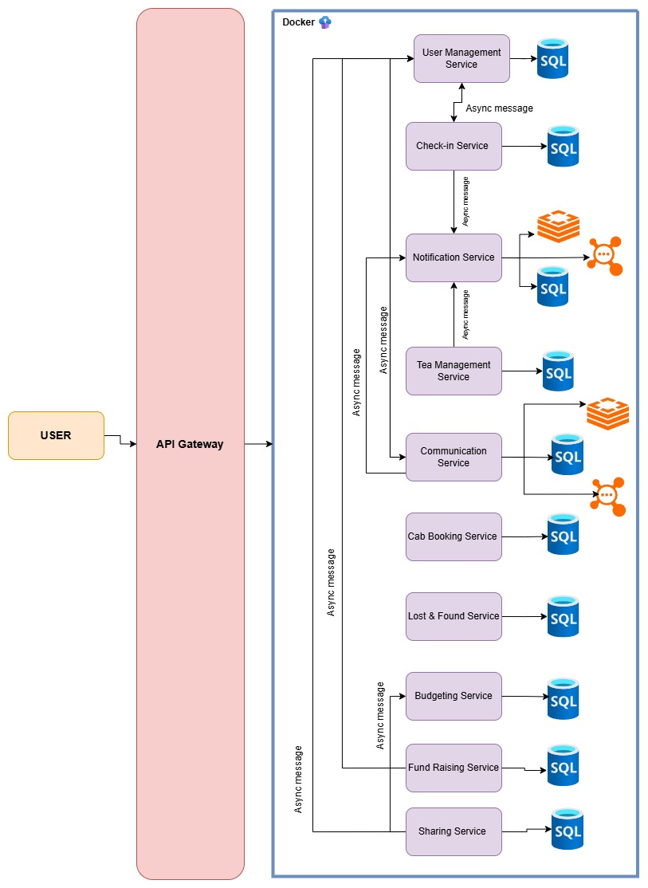

# FAF Cab Microservices Architecture

This repository contains the set of microservices powering **FAF Cab** and its community operations.  
Each service has a **clear boundary** and encapsulates specific functionality to ensure modularity, independence, and maintainability.  

---

## 📌 Service Boundaries

### 1. User Management Service
- **Responsibilities**:
  - Register and manage users.
  - Store details such as name, nickname, group, and role (student, teacher, admin).
  - Integrate with **Discord** to fetch information from the FAF Community Server.
- **Boundaries**:
  - Owns all user-related data and authentication.
  - Provides APIs for other services to fetch user details (nickname, role).
  - Does **not** handle notifications or resource tracking.

---

### 2. Notification Service
- **Responsibilities**:
  - Send notifications to the right people in a timely manner.
  - Cover cases such as:
    - Supplies running low.
    - Visitor exit reminders during bookings.
    - Communication infractions or bans.
- **Boundaries**:
  - Does not track resources itself; it only **consumes events** from other services and delivers messages.
  - Serves as the central notification hub.

---

### 3. Tea Management Service
- **Responsibilities**:
  - Track consumables (tea, sugar, paper cups, markers, etc.).
  - Record which user consumes what and when.
  - Trigger notifications when consumables run low or when a user overuses resources.
- **Boundaries**:
  - Owns inventory data for consumables.
  - Provides events to **Notification Service** and **Budgeting Service**.

---

### 4. Communication Service
- **Responsibilities**:
  - Allow users to find each other by nickname.
  - Enable public and private chats with individuals or groups.
  - Apply censorship with a banned-words list.
  - Enforce infractions and bans (temporary or permanent).
- **Boundaries**:
  - Owns messaging data and moderation logic.
  - Relies on **User Management Service** for nicknames and roles.
  - Sends infractions to **Notification Service**.

---

### 5. Cab Booking Service
- **Responsibilities**:
  - Manage scheduling of meetings in main room or kitchen.
  - Prevent collisions between exams, games, and other activities.
  - Allow students and teachers to book spaces.
  - Integrate with **Google Calendar**.
- **Boundaries**:
  - Owns booking schedules.
  - Provides booking status APIs to other services.
  - Triggers notifications (via **Notification Service**) for reminders and conflicts.

---

### 6. Check-in Service
- **Responsibilities**:
  - Simulate CCTV facial recognition for user entry/exit tracking.
  - Answer: *“Who has the key?”*
  - Allow registration of one-time guests.
  - Notify admins of unknown persons.
- **Boundaries**:
  - Owns check-in/check-out logs.
  - Relies on **User Management Service** for identity validation.
  - Publishes events to **Notification Service**.

---

### 7. Lost & Found Service
- **Responsibilities**:
  - Allow users to post announcements about lost or found items.
  - Support multiple comment threads per post.
  - Allow posts to be marked as resolved.
- **Boundaries**:
  - Owns lost & found posts and comments.
  - Can trigger notifications when a new post is created or resolved.

---

### 8. Budgeting Service
- **Responsibilities**:
  - Track funds flowing in and out of FAF Cab & FAF NGO.
  - Maintain logs of spending and donations.
  - Manage a debt book for users who overuse or break property.
  - Allow admins to export reports as CSV.
- **Boundaries**:
  - Owns treasury and financial data.
  - Receives updates from **Tea Management Service**, **Sharing Service**, and **Fund Raising Service**.

---

### 9. Fund Raising Service
- **Responsibilities**:
  - Enable admins to raise funds for purchases.
  - Store fundraising goals, deadlines, and donations.
  - Track donor contributions.
  - Automatically register new objects in **Tea Management** or **Sharing Service** after successful campaigns.
  - Update **Budgeting Service** with funds and expenses.
- **Boundaries**:
  - Owns fundraising campaigns and donor data.
  - Delegates financial tracking to **Budgeting Service**.

---

### 10. Sharing Service
- **Responsibilities**:
  - Track multi-use objects (games, cords, cups, kettles).
  - Allow users to rent and return objects.
  - Track object condition (damaged, missing parts, etc.).
  - Notify owners/admins if an object is misused or broken.
  - Update debt book for damages (via **Budgeting Service**).
- **Boundaries**:
  - Owns sharing inventory.
  - Publishes events to **Notification Service** and **Budgeting Service**.
  
  ---

## 🔗 Architecture Diagram

